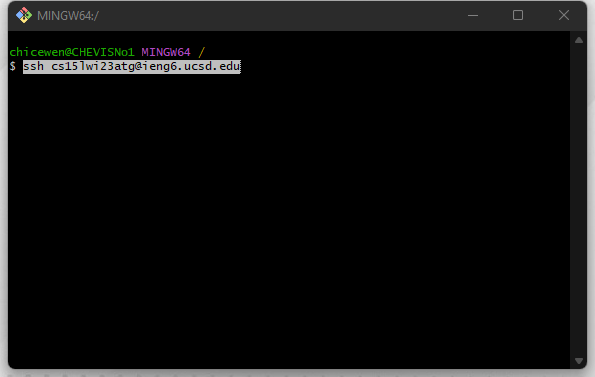
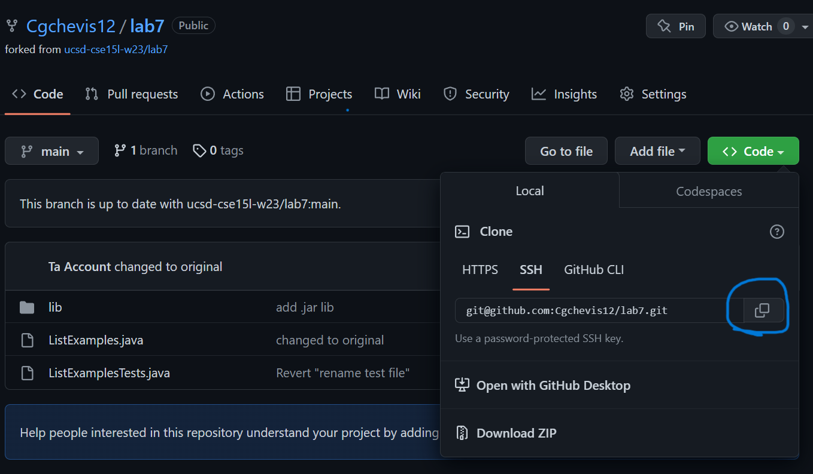
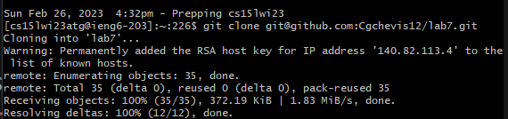
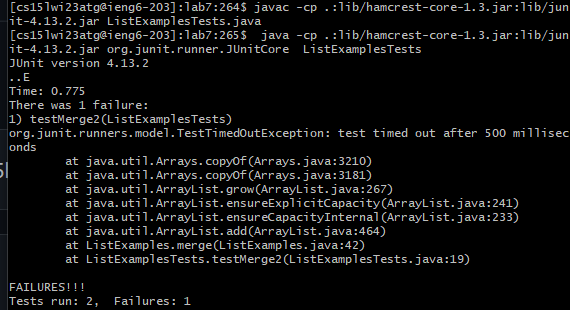
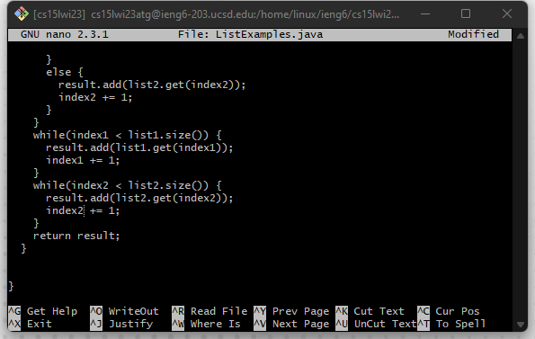
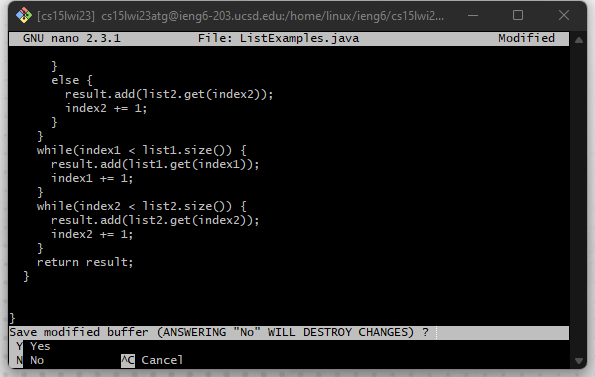
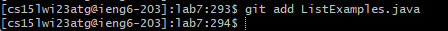
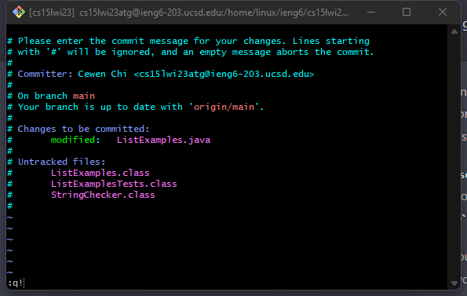

1.Log into ieng6



```
keys:
<Ctrl-C> User name
<Ctrl-v> User name to terminal
<enter>
```

2.Clone your fork of the repository from your Github account
 
 
 
 
 ```
  Keys:
  click copy the SSH link, and in the ieng6, type git clone + 
  <Ctrl-v>
  <enter>
 ```

3.Run the tests, demonstrating that they fail:

    
   

```
    Keys: 
    <up><up><up><up><enter>
    <up><up><up><up><up><enter>
```

The javac -cp .:lib/hamcrest-core-1.3.jar:lib/junit-4.13.2.jar ListExamples.java command was 4 up in the search history, so I used up arrow to access it. Then the java -cp .:lib/hamcrest-core-1.3.jar:lib/junit-4.13.2.jar org.junit.runner.JUnitCore ListExamples command was 4 up in the history, so I accessed and ran it in the same way.

4. Edit the code file to fix the failing test
     
      
     
      
     
      
      
      ```
      keys:
      nano ListExamples
      <Ctrl-E>
      <up><up><up><up><up><up><up>
      <right>*12
      delete
      numerical type 2
      Ctrl+o
      Ctrl+x
      ```
      5.Run the tests, demonstrating that they now succeed
      

    
```
    Keys: 
    <up><up><enter>
    <up><up><up><enter>
 ```   
The javac -cp .:lib/hamcrest-core-1.3.jar:lib/junit-4.13.2.jar ListExamples.java command was 4 up in the search history, so I used up arrow to access it. Then the java -cp .:lib/hamcrest-core-1.3.jar:lib/junit-4.13.2.jar org.junit.runner.JUnitCore ListExamples command was 4 up in the history, so I accessed and ran it in the same way.
   
6. Commit and push the resulting change to your Github account (you can pick any commit message!):
     





     


      keys：
        git add ListExamples
        git commit -m"updates"
        :ql
        git push

      
      markdown reference:
        https://ucsd-cse15l-w23.github.io/week/week7/#baseline
