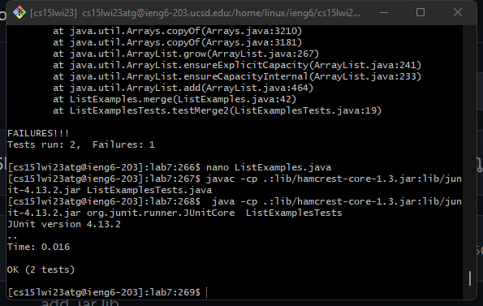

1.Log into ieng6


```
keys:
<Ctrl-C> User name
<Ctrl-v> User name to terminal
<enter>
```
Log into ieng6 account by using the user name without password because it's already authorized as the SSH key

2.Clone your fork of the repository from your Github account
 
 
 
 
 ```
  Keys:
  git clone https://github.com/ucsd-cse15l-w23/lab7.git 
  <Ctrl-v>
  <enter>
 ```
 Clone github repository to ieng6 through the command git clone + ssh code
 
 3.Run the tests, demonstrating that they fail:

  


```
    Keys: 
    <up><up><up><up><enter>
    <up><up><up><up><up><enter>
```
The javac -cp .:lib/hamcrest-core-1.3.jar:lib/junit-4.13.2.jar ListExamples.java command was 4 up in the search history, so I used up arrow to access it. Then the java -cp .:lib/hamcrest-core-1.3.jar:lib/junit-4.13.2.jar org.junit.runner.JUnitCore ListExamples command was 4 up in the history, so I accessed and ran it in the same way.

4. Edit the code file to fix the failing test
     
      
     
      
     
      
      
      ```
      keys:
      nano ListExamples
      <Ctrl-E>
      <up><up><up><up><up><up><up>
      <right>*12
      delete
      numerical type 2
      Ctrl+o
      Ctrl+x
      ```
      After entering in the nano txt editor, edit the file through commands and then save the change
      
   5.Run the tests, demonstrating that they now succeed
      

    
```
    Keys: 
    <up><up><enter>
    <up><up><up><enter>
 ```   
The javac -cp .:lib/hamcrest-core-1.3.jar:lib/junit-4.13.2.jar ListExamples.java command was 4 up in the search history, so I used up arrow to access it. Then the java -cp .:lib/hamcrest-core-1.3.jar:lib/junit-4.13.2.jar org.junit.runner.JUnitCore ListExamples command was 4 up in the history, so I accessed and ran it in the same way.
After the bug fixed through the nano txt editor, run the junit tester which shows run without bug
   
6. Commit and push the resulting change to your Github account (you can pick any commit message!):
     


     
After the bug fixed in the ieng6, using git add, git commit and git push to update the code file on the github

      keys：
        git add ListExamples
        git commit -m"updates"
        :ql
        git push

      
      markdown reference:
        https://ucsd-cse15l-w23.github.io/week/week7/#baseline
